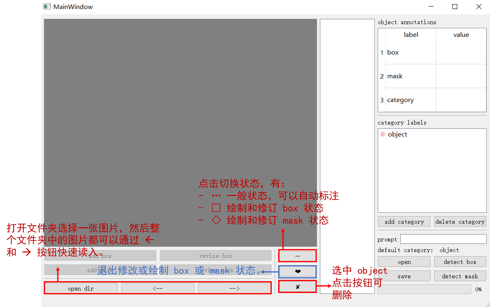
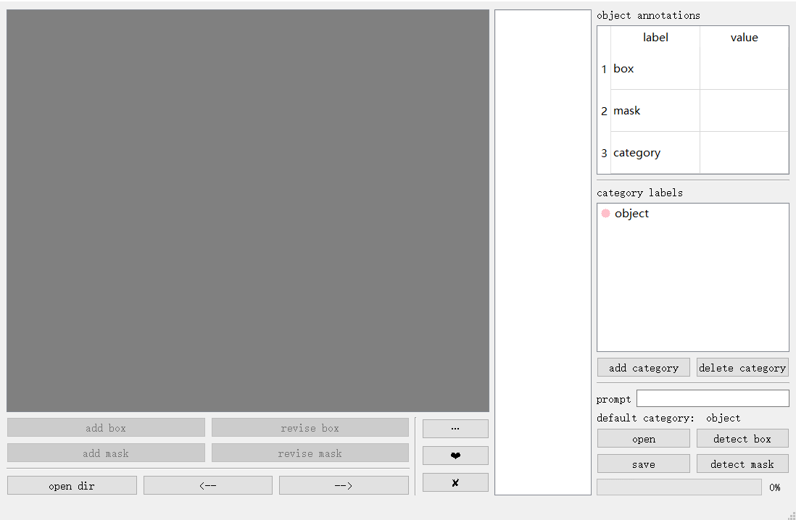
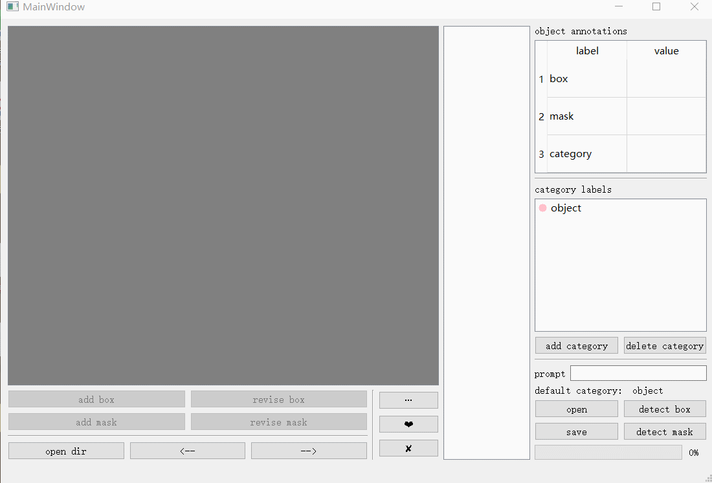
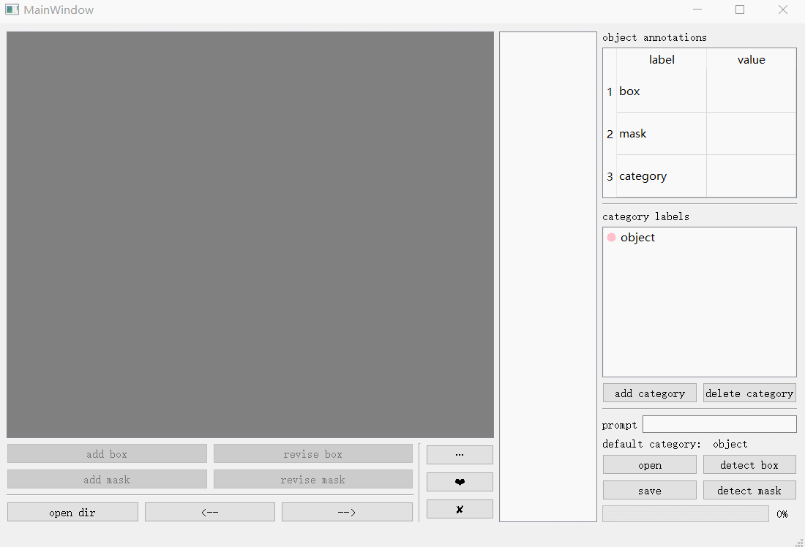

# quick-label
这是一个可以快速标注实例分割数据的标注软件。本软件包含以下功能：
1. 手动标注 bounding box 框和 mask 多边形
2. 输入想标记的物体的类别文本，利用 grounding dino 自动标注 bounding box
3. 根据手动或自动的 bounding box，利用 segment anything 模型自动标注 mask
4. 修改自动标注中的错误（类别错误、定位错误）
5. 提供脚本，支持批量处理并保存。然后使用软件读入事先生成的标注文件，修改模型中标注错误的部分。

# Install
因为本软件寄托于 grounding dino 和 segment anything 这两个模型，所以需要保证成功部署这两个模型到本地，不然只能使用手动标注功能，不能使用自动标注功能。

1. 从 github clone quick-label 代码
```bash
git clone https://github.com/gaoCleo/quick-label.git
```

2. 部署 [grounding dino](https://github.com/IDEA-Research/GroundingDINO)
```bash
cd object_detector
# Clone the GroundingDINO repository from GitHub
git clone https://github.com/IDEA-Research/GroundingDINO.git
# Change the current directory to the GroundingDINO folder
cd GroundingDINO/
# Install the required dependencies in the current directory
# 这一步还有编译，不只是下载包，所以不能跳过这一步！！
pip install -e .

# Download pre-trained model weights
mkdir weights
cd weights
wget -q https://github.com/IDEA-Research/GroundingDINO/releases/download/v0.1.0-alpha/groundingdino_swint_ogc.pth
cd ..
```

测试 grounding dino 是否部署成功：
```bash
cd /your/root/path/quick-label
python ./grounding_dino_test.py
```
打印如下则说明成功部署：
```
([[49.296470642089844, 34.962093353271484, 187.845703125, 136.22267150878906]], [0.8314283490180969])
```

可能的报错：
- 因为现在 hugging face 貌似无法访问，可以先把 bert-base-uncased 的源码下载到本地，然后把 grounding dino 代码中 groundingdino/util/get_tokenlizer.py 中 19 行 `AutoTokenizer.from_pretrained` 的参数改为本地地址；把 25 行 `BertModel.from_pretrained`的参数也改为本地地址
- _C 文件没有。那是你没有编译成功，不要跳过编译那句 `pip install -e .`

最后项目的格式应该为：
```
+quick-label
|---+object_detector
|---|---+GoundingDINO
|---|---|---+groundingdino
|---|---|---+weights
```

3. 部署 [segment anything](https://github.com/facebookresearch/segment-anything)
```bash
# Sam 的代码已经在这个项目中了，只需要下载预训练文件放在 segment/segment_anything 下面就好了
cd /your/root/path/quick-label/segment/segment_anything
wget https://dl.fbaipublicfiles.com/segment_anything/sam_vit_h_4b8939.pth
```

测试是否部署成功：
```bash
cd /your/root/path/quick-label
python ./sam_test.py
```
打印如下内容则成功：
`[[[60, 49], [52, 63], [58, 62], ...`

# Quick start
```bash
cd quick_label
python .\main.py
```

## 修改默认保存地址（可选）
标注文件的默认保存地址在 quick_label 的同一级别 savedir 文件夹中
```
+ root_dir
|---+quick_label
|---+savedir
```
如果想放在自己设置的文件夹下，修改 `my_config.py` 中的默认地址即可。

## 手动标注

## 自动标注

## 脚本批量标注后修改
```bash
python quick_seg_label.py --sr_dir /source/path/dir --ds_dir /save/path/dir --prompt category_name
```
注意，修改后不会覆盖重写原标注文件，而是将新的文件保存在默认保存地址中。修改默认保存地址见[修改默认保存地址](#修改默认保存地址（可选）)
